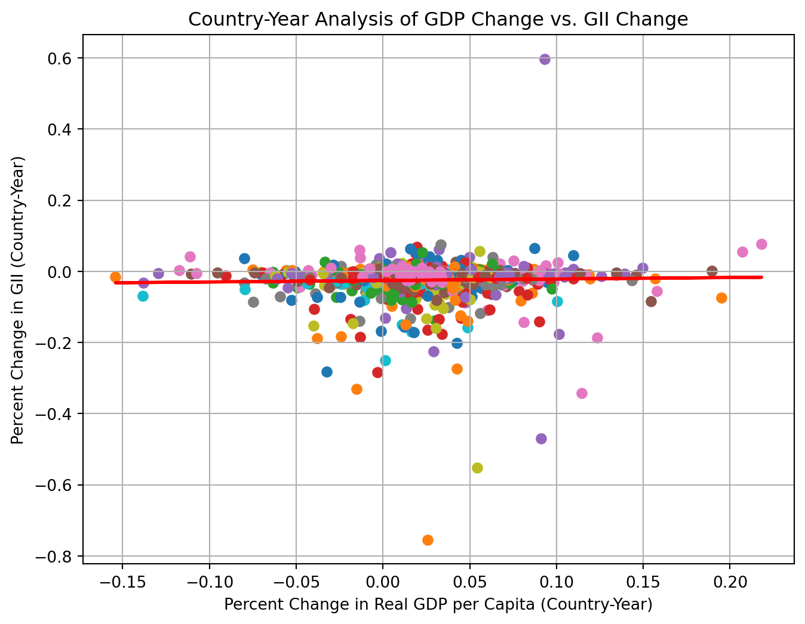
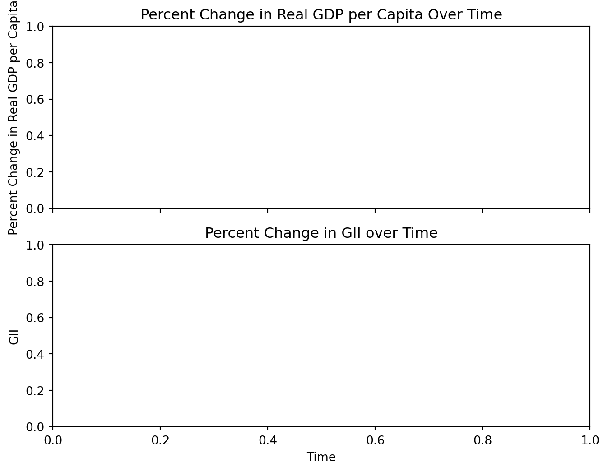
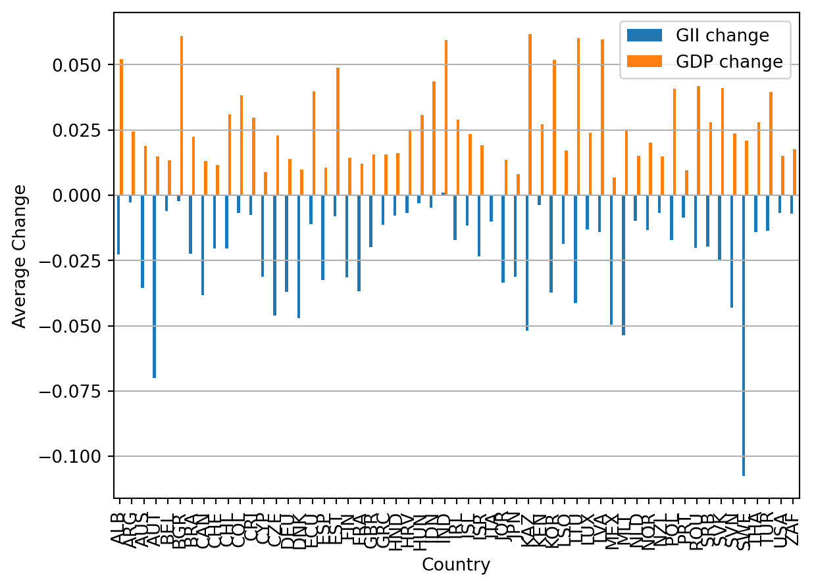
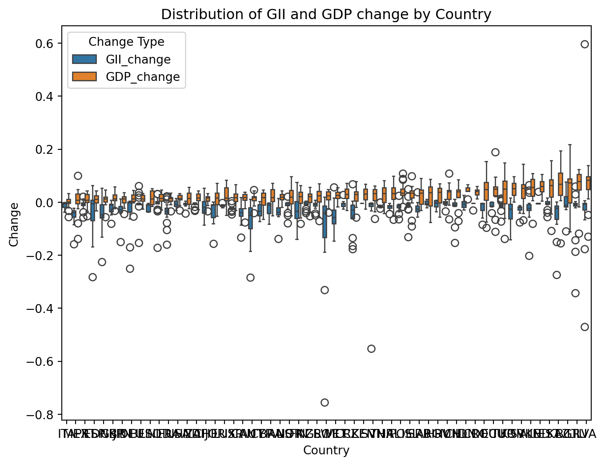
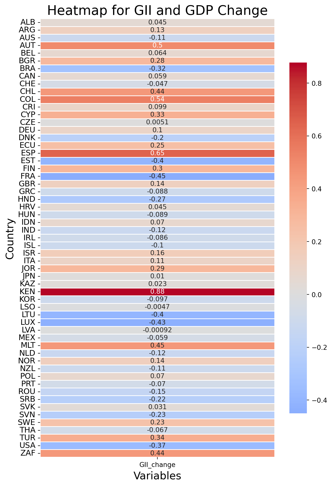
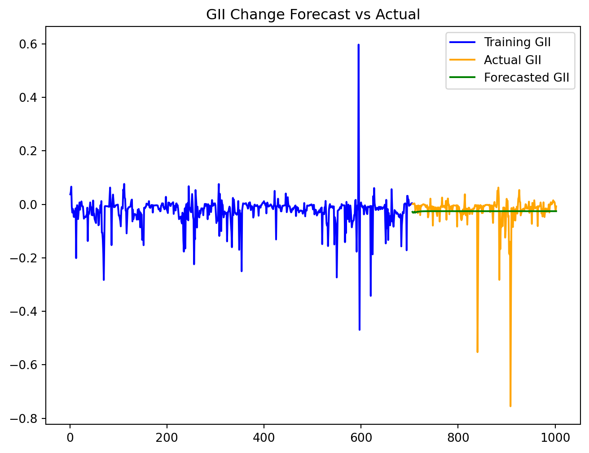
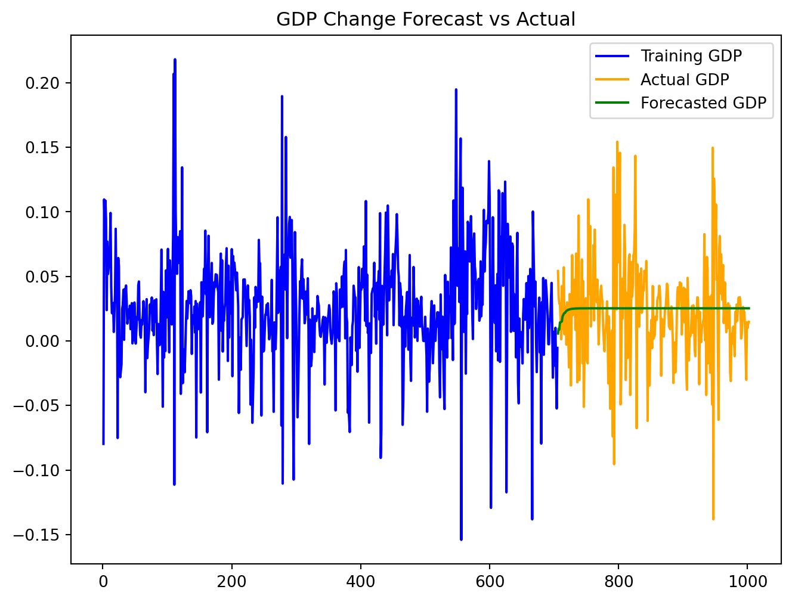

# Economic Growth and Gender Equality: An Analysis Using IMF Data

This data analysis project aims to explore the relationship between economic growth and gender equality using `imfp`, which allows us to download data from IMF (International Monetary Fund). `imfp` can be integrated with other python tools to streamline the computational process. To demonstrate its functionality, the project experimented with a variety of visualization and analysis methods.


# Executive Summary

In this project, we explored the following:

1.  **Data Fetching**

- Make API call to fetch 4 datasets: GII (Gender Inequality Index), Nominal GDP, GDP Deflator Index, Population series

2.  **Feature Engineering**

- Cleaning: Convert GDP Deflator Index to a yearly basis and variables to numeric
- Dependent Variable: Percent Change of Gender Inequality Index
- Independent Variable: Percent Change of Real GDP per Capita
- Transform variables to display magnitude of change
- Merge the datasets

3.  **Data Visualization**

- Scatterplot
- Time Series Line Plots
- Barplot
- Boxplot
- Heatmap

4.  **Statistical Analysis**

- Descriptive Statistics
- Regression Analysis
- Time Series Analysis


# Utility Functions

The integration of other Python tools not only streamlined our computational processes but also ensured consistency across the project.

A custom module is written to simplify the process of making API calls and fetching information with imfp library. `load_or_fetch_databases`, `load_or_fetch_parameters` `load_or_fetch_dataset` load and retreive database, parameters, and dataset from a local or remote source. `view_dataframe_in_browser` displays dataframe in a web browser.


``` python
import os
import pickle
from tempfile import NamedTemporaryFile
import pandas as pd
import imfp
import webbrowser


# Function to display a DataFrame in a web browser
def view_dataframe_in_browser(df):
    html = df.to_html()
    with NamedTemporaryFile(delete=False, mode="w", suffix=".html") as f:
        url = "file://" + f.name
        f.write(html)
    webbrowser.open(url)


# Function to load databases from CSV or fetch from API
def load_or_fetch_databases():
    csv_path = os.path.join("data", "databases.csv")

    # Try to load from CSV
    if os.path.exists(csv_path):
        try:
            return pd.read_csv(csv_path)
        except Exception as e:
            print(f"Error loading CSV: {e}")

    # If CSV doesn't exist or couldn't be loaded, fetch from API
    print("Fetching databases from IMF API...")
    databases = imfp.imf_databases()

    # Save to CSV for future use
    databases.to_csv(csv_path, index=False)
    print(f"Databases saved to {csv_path}")

    return databases


def load_or_fetch_parameters(database_name):
    pickle_path = os.path.join("data", f"{database_name}.pickle")

    # Try to load from pickle file
    if os.path.exists(pickle_path):
        try:
            with open(pickle_path, "rb") as f:
                return pickle.load(f)
        except Exception as e:
            print(f"Error loading pickle file: {e}")

    # If pickle doesn't exist or couldn't be loaded, fetch from API
    print(f"Fetching parameters for {database_name} from IMF API...")
    parameters = imfp.imf_parameters(database_name)

    # Save to pickle file for future use
    os.makedirs("data", exist_ok=True)  # Ensure the data directory exists
    with open(pickle_path, "wb") as f:
        pickle.dump(parameters, f)
    print(f"Parameters saved to {pickle_path}")

    return parameters


def load_or_fetch_dataset(database_id, indicator):
    file_name = f"{database_id}.{indicator}.csv"
    csv_path = os.path.join("data", file_name)

    # Try to load from CSV file
    if os.path.exists(csv_path):
        try:
            return pd.read_csv(csv_path)
        except Exception as e:
            print(f"Error loading CSV file: {e}")

    # If CSV doesn't exist or couldn't be loaded, fetch from API
    print(f"Fetching dataset for {database_id}.{indicator} from IMF API...")
    dataset = imfp.imf_dataset(database_id=database_id, indicator=[indicator])

    # Save to CSV file for future use
    os.makedirs("data", exist_ok=True)  # Ensure the data directory exists
    dataset.to_csv(csv_path, index=False)
    print(f"Dataset saved to {csv_path}")

    return dataset
```


# Dependencies

Here is a brief introduction about the packages used:

`pandas`: view and manipulate data frame

`matplotlib.pyplot`: make plots

`seaborn`: make plots

`numpy`: computation

`LinearRegression`: implement linear regression

`tabulate`: format data into tables

`statsmodels.api`, `adfuller`, `ARIMA`,`VAR`,`plot_acf`,`plot_pacf`,`mean_absolute_error`,`mean_squared_error`, and`grangercausalitytests` are specifically used for time series analysis.

`pycountry`: convert between ISO2 and ISO3 country codes (install with `pip install pycountry`)


``` python
import pandas as pd
import matplotlib.pyplot as plt
import seaborn as sns
import numpy as np
from sklearn.linear_model import LinearRegression
from tabulate import tabulate
import statsmodels.api as sm
from statsmodels.tsa.stattools import adfuller
from statsmodels.tsa.arima.model import ARIMA
from statsmodels.tsa.vector_ar.var_model import VAR
from statsmodels.graphics.tsaplots import plot_acf, plot_pacf
from sklearn.metrics import mean_absolute_error
from sklearn.metrics import mean_squared_error
from statsmodels.tsa.stattools import grangercausalitytests
import pycountry
```


# Data Fetching

In this section, we load four datasets: Gender Inequality Index (GII) from a CSV file, and fetch GDP Deflator, Nominal GDP, and Population through API calls to the IMF.


``` python
from pathlib import Path
Path("data").mkdir(exist_ok=True)
```


``` python
# Load or fetch databases
databases = load_or_fetch_databases()

# Filter out databases that contain a year in the description
databases[
  ~databases['description'].str.contains(r"[\d]{4}", regex=True)
]

# view_dataframe_in_browser(databases)
```


    Fetching databases from IMF API...
    Databases saved to data/databases.csv


|     | database_id | description                                       |
|-----|-------------|---------------------------------------------------|
| 1   | MCDREO      | Middle East and Central Asia Regional Economic... |
| 3   | PCPS        | Primary Commodity Price System (PCPS)             |
| 4   | MFS_DC      | Monetary and Financial Statistics (MFS), Depos... |
| 5   | LS          | Labor Statistics (LS)                             |
| 8   | PIP         | Portfolio Investment Positions by Counterpart ... |
| ... | ...         | ...                                               |
| 210 | BOP_AGG     | Balance of Payments and International Investme... |
| 212 | MFS_FC      | Monetary and Financial Statistics (MFS), Finan... |
| 216 | AEA         | Air Emissions Accounts (AEA)                      |
| 220 | FM          | Fiscal Monitor (FM)                               |
| 221 | ANEA        | National Economic Accounts (NEA), Annual Data     |

101 rows × 2 columns


Three IMF databases were used: World Economic Outlook (WEO), and National Economic Accounts (QNEA, ANEA).

> **Note: Database Changes**
>
> The IMF has updated their API structure. The former IFS (International Financial Statistics) database has been discontinued and replaced with more specialized databases. This demo now uses:
>
> - **QNEA**: Quarterly National Economic Accounts for GDP deflator
> - **ANEA**: Annual National Economic Accounts for nominal GDP
> - **WEO**: World Economic Outlook for population data
>
> Note: The Gender Inequality Index (GII) is a UN dataset that is no longer available through the IMF API. We'll load it from a pre-downloaded CSV file instead.


``` python
databases[databases['database_id'].isin(['QNEA','ANEA','WEO'])]
```


|     | database_id | description                                      |
|-----|-------------|--------------------------------------------------|
| 74  | QNEA        | National Economic Accounts (NEA), Quarterly Data |
| 166 | WEO         | World Economic Outlook (WEO)                     |
| 221 | ANEA        | National Economic Accounts (NEA), Annual Data    |


Parameters are dictionary key names to make requests from the databases. "country" is the ISO-3 code of the country. "indicator" refers to the code representing a specific dataset in the database.


``` python
datasets_list = ["QNEA", "ANEA", "WEO"]
params = {}

# Fetch valid parameters for datasets
for dataset in datasets_list:
    params[dataset] = load_or_fetch_parameters(dataset)

    valid_keys = list(params[dataset].keys())
    print(f"Parameters for {dataset}: ", valid_keys)
```


    Fetching parameters for QNEA from IMF API...
    Parameters saved to data/QNEA.pickle
    Parameters for QNEA:  ['country', 'indicator', 'price_type', 's_adjustment', 'type_of_transformation', 'frequency']
    Fetching parameters for ANEA from IMF API...
    Parameters saved to data/ANEA.pickle
    Parameters for ANEA:  ['country', 'indicator', 'price_type', 'type_of_transformation', 'frequency']
    Fetching parameters for WEO from IMF API...
    Parameters saved to data/WEO.pickle
    Parameters for WEO:  ['country', 'indicator', 'frequency']


We'll need to update the `load_or_fetch_dataset` function to handle the new database parameters:


``` python
def load_or_fetch_dataset_with_params(database_id, filename_suffix, **kwargs):
    """Fetch dataset with flexible parameters for new IMF databases"""
    file_name = f"{database_id}.{filename_suffix}.csv"
    csv_path = os.path.join("data", file_name)

    # Try to load from CSV file
    if os.path.exists(csv_path):
        try:
            return pd.read_csv(csv_path)
        except Exception as e:
            print(f"Error loading CSV file: {e}")

    # If CSV doesn't exist or couldn't be loaded, fetch from API
    print(f"Fetching dataset for {database_id}.{filename_suffix} from IMF API...")
    dataset = imfp.imf_dataset(database_id=database_id, **kwargs)

    # Save to CSV file for future use
    os.makedirs("data", exist_ok=True)
    dataset.to_csv(csv_path, index=False)
    print(f"Dataset saved to {csv_path}")

    return dataset

def convert_iso2_to_iso3(iso2_code):
    """Convert ISO2 country code to ISO3"""
    try:
        # Handle NaN or non-string values
        if pd.isna(iso2_code) or not isinstance(iso2_code, str):
            return None
        country = pycountry.countries.get(alpha_2=iso2_code.upper())
        return country.alpha_3 if country else None
    except (KeyError, AttributeError, LookupError):
        return None
```


Now fetch the datasets using the new databases:


``` python
# Gender Inequality Index - Load from CSV (UN dataset, not available via IMF API)
GII_data = pd.read_csv("data/GENDER_EQUALITY.GE_GII.csv")

# Convert ISO2 country codes (ref_area) to ISO3 (country) to match IMF datasets
GII_data['country'] = GII_data['ref_area'].apply(convert_iso2_to_iso3)

# Drop rows where country code conversion failed
GII_data = GII_data.dropna(subset=['country'])

print(f"Loaded {len(GII_data)} GII observations")
print(f"Sample country codes: {GII_data['country'].unique()[:5]}")

# GDP Deflator (Quarterly, Index)
GDP_deflator_data = load_or_fetch_dataset_with_params(
    "QNEA",
    "B1GQ_PD_IX",
    indicator="B1GQ",
    price_type="PD",  # Price deflator
    type_of_transformation="IX",  # Index
    frequency="Q"
)

# Nominal GDP (Annual, Domestic Currency)
GDP_nominal_data = load_or_fetch_dataset_with_params(
    "ANEA",
    "B1GQ_V_XDC",
    indicator="B1GQ",
    price_type="V",  # Current prices
    type_of_transformation="XDC",  # Domestic currency
    frequency="A"
)

# Population (Annual)
GDP_population_data = load_or_fetch_dataset_with_params(
    "WEO",
    "LP",
    indicator=["LP"],
    frequency="A"
)
```


    Loaded 3065 GII observations
    Sample country codes: ['AFG' 'ALB' 'DZA' 'ARG' 'ARM']
    Fetching dataset for QNEA.B1GQ_PD_IX from IMF API...
    Dataset saved to data/QNEA.B1GQ_PD_IX.csv
    Fetching dataset for ANEA.B1GQ_V_XDC from IMF API...
    Dataset saved to data/ANEA.B1GQ_V_XDC.csv
    Fetching dataset for WEO.LP from IMF API...
    Dataset saved to data/WEO.LP.csv


# Feature Engineering


## Data Cleaning

Since the GDP deflator was reported on a quarterly basis, we converted it to a yearly basis.


``` python
# Keep only rows with a partial string match for "Q4" in the time_period column
GDP_deflator_data = GDP_deflator_data[GDP_deflator_data
['time_period'].str.contains("Q4")]
```


``` python
# Split the time_period into year and quarter and keep the year only
GDP_deflator_data.loc[:, 'time_period'] = GDP_deflator_data['time_period'].str[0:4]
```


We make all the variables numeric.

> **Note: Unit Multiplier Changes**
>
> The new IMF API returns values in the correct units, so we no longer need to apply unit multipliers. The `unit_mult` column has been removed from most datasets.


``` python
datasets = [GII_data, GDP_deflator_data, GDP_nominal_data, GDP_population_data]

for i, dataset in enumerate(datasets):    
    # Use .loc to modify the columns
    datasets[i].loc[:, 'obs_value'] = pd.to_numeric(datasets[i]['obs_value'], 
    errors='coerce')
    datasets[i].loc[:, 'time_period'] = pd.to_numeric(datasets[i]['time_period'], 
    errors='coerce')
```


## GII Percent Change: Dependent Variable

We kept percents as decimals to make them easy to work with for calculation. Different countries have different baseline level of economic growth and gender equality. We calculated the percent change to make them comparable.

Gender Inequality Index (GII) is a composite measure of gender inequality using three dimensions: reproductive health, empowerment, and labor market. GII ranges from 0 to 1. While 0 indicates gender equality, 1 indicates gender inequality, possibly the worst outcome for one gender in all three dimensions.


``` python
# Calculate percent change for each country
# First, create a copy and reset the index to avoid duplicate index issues
GII_data_sorted = GII_data.sort_values(
    ['country', 'time_period']).reset_index(drop=True)
GII_data['pct_change'] = GII_data_sorted.groupby('country')['obs_value'].pct_change()

# Display the first few rows of the updated dataset
GII_data.head()
```


|  | freq | ref_area | indicator | unit_mult | time_format | time_period | obs_value | country | pct_change |
|----|----|----|----|----|----|----|----|----|----|
| 0 | A | AF | GE_GII | 0 | P1Y | 1990 | 0.828244 | AFG | NaN |
| 1 | A | AF | GE_GII | 0 | P1Y | 1991 | 0.817706 | AFG | -0.012723 |
| 2 | A | AF | GE_GII | 0 | P1Y | 1992 | 0.809806 | AFG | -0.009662 |
| 3 | A | AF | GE_GII | 0 | P1Y | 1993 | 0.803078 | AFG | -0.008308 |
| 4 | A | AF | GE_GII | 0 | P1Y | 1994 | 0.797028 | AFG | -0.007533 |


We subset the data frame to keep only the columns we want:


``` python
# Create a new dataframe with only the required columns
GII_data = GII_data[['country', 'time_period', 'obs_value', 'pct_change']].copy()

GII_data = GII_data.rename(columns = {
    'country': 'Country',
    'time_period': 'Time',
    'obs_value': 'GII',
    'pct_change': 'GII_change'
})

# Display the first few rows of the new dataset
GII_data.head()
```


|     | Country | Time | GII      | GII_change |
|-----|---------|------|----------|------------|
| 0   | AFG     | 1990 | 0.828244 | NaN        |
| 1   | AFG     | 1991 | 0.817706 | -0.012723  |
| 2   | AFG     | 1992 | 0.809806 | -0.009662  |
| 3   | AFG     | 1993 | 0.803078 | -0.008308  |
| 4   | AFG     | 1994 | 0.797028 | -0.007533  |


## GDP Percent Change: Independent Variable

Real GDP per capita is a measure of a country's economic welfare or standard of living. It is a great tool comparing a country's economic development compared to other economies. Due to dataset access issue, we calculated Real GDP per capita by the following formula using GDP Deflator, Nominal GDP, and Population data:

\text{Real GDP} = \frac{\text{Nominal GDP}}{\text{GDP Deflator Index}}\times 100

\text{Real GDP per capita} = \frac{\text{Real GDP}}{\text{Population}}

GDP Deflator is a measure of price inflation and deflation with respect to a specific base year. The GDP deflator of a base year is equal to 100. A number of 200 indicates price inflation: the current year price of the good is twice its base year price. A number of 50 indicates price deflation: the current year price of the good is half its base year price. We kept the columns we want only for GDP-related datasets for easier table merging.


``` python
# GDP Deflator Dataset
# Create a new dataframe with only the required columns
GDP_deflator_data = GDP_deflator_data[
    ['country', 'time_period', 'obs_value']].copy()

# Display the first few rows of the new dataset
GDP_deflator_data.head()
```


|     | country | time_period | obs_value |
|-----|---------|-------------|-----------|
| 3   | ALB     | 1996        | 55.229150 |
| 7   | ALB     | 1997        | 60.439943 |
| 11  | ALB     | 1998        | 63.745473 |
| 15  | ALB     | 1999        | 67.101488 |
| 19  | ALB     | 2000        | 70.301830 |


Nominal GDP is the total value of all goods and services produced in a given time period. It is usually higher than Real GDP and does not take into account cost of living in different countries or price change due to inflation/deflation.


``` python
# GDP Nominal Data
# Create a new dataframe with only the required columns
GDP_nominal_data = GDP_nominal_data[
    ['country', 'time_period', 'obs_value']].copy()

# Display the first few rows of the new dataset
GDP_nominal_data.head()
```


|     | country | time_period | obs_value    |
|-----|---------|-------------|--------------|
| 0   | AFG     | 2010        | 7.035025e+11 |
| 1   | AFG     | 2011        | 8.378513e+11 |
| 2   | AFG     | 2012        | 1.007959e+12 |
| 3   | AFG     | 2013        | 1.102256e+12 |
| 4   | AFG     | 2014        | 1.116353e+12 |


Population is the total number of people living in a country at a given time. This is where the "per capita" comes from. Real GDP is the total value of all goods and services produced in a country adjusted for inflation. Real GDP per capita is the total economic output per person in a country.


``` python
# GDP Population Data 
# Create a new dataframe with only the required columns
GDP_population_data = GDP_population_data[
    ['country', 'time_period', 'obs_value']].copy()

# Display the first few rows of the new dataset
GDP_population_data.head()
```


|     | country | time_period | obs_value |
|-----|---------|-------------|-----------|
| 0   | ABW     | 1986        | 81163.0   |
| 1   | ABW     | 1987        | 84883.0   |
| 2   | ABW     | 1988        | 87721.0   |
| 3   | ABW     | 1989        | 89181.0   |
| 4   | ABW     | 1990        | 90135.0   |


``` python
# Combine all the datasets above for further calculation
merged_df = pd.merge(pd.merge(GDP_deflator_data, GDP_nominal_data, 
on=['time_period', 'country'], 
suffixes=('_index', '_nominal'), 
how='inner'), 
GDP_population_data, 
on=['time_period', 'country'], 
how='inner')

# Rename columns for clarity
merged_df = merged_df.rename(columns={
    'obs_value_index': 'deflator',
    'obs_value_nominal': 'nominal',
    'obs_value': 'population'
})

# Display the first few rows of the dataset
merged_df.head()
```


|     | country | time_period | deflator  | nominal      | population |
|-----|---------|-------------|-----------|--------------|------------|
| 0   | ALB     | 1996        | 55.229150 | 3.380003e+11 | 3168033.0  |
| 1   | ALB     | 1997        | 60.439943 | 3.364808e+11 | 3148281.0  |
| 2   | ALB     | 1998        | 63.745473 | 3.930700e+11 | 3128530.0  |
| 3   | ALB     | 1999        | 67.101488 | 4.535123e+11 | 3108778.0  |
| 4   | ALB     | 2000        | 70.301830 | 5.162068e+11 | 3089027.0  |


We wanted to compute the Real GDP per capita.


``` python
# Step 1: Real GDP = (Nominal GDP / GDP Deflator Index)*100
merged_df['Real_GDP_domestic'] = (merged_df['nominal'] / merged_df[
    'deflator'])*100

# Step 2: Real GDP per Capita = Real GDP / Population
merged_df['Real_GDP_per_capita'] = merged_df['Real_GDP_domestic'] / merged_df[
    'population']

# Rename columns
merged_df = merged_df.rename(columns= {
    "country": "Country",
    "time_period": "Time",
    "nominal": "Nominal",
    "deflator": "Deflator",
    "population": "Population",
    "Real_GDP_domestic": "Real GDP",
    "Real_GDP_per_capita": "Real GDP per Capita"
}
)
# Check the results
merged_df.head()
```


|  | Country | Time | Deflator | Nominal | Population | Real GDP | Real GDP per Capita |
|----|----|----|----|----|----|----|----|
| 0 | ALB | 1996 | 55.229150 | 3.380003e+11 | 3168033.0 | 6.119962e+11 | 193178.611306 |
| 1 | ALB | 1997 | 60.439943 | 3.364808e+11 | 3148281.0 | 5.567193e+11 | 176832.775703 |
| 2 | ALB | 1998 | 63.745473 | 3.930700e+11 | 3128530.0 | 6.166241e+11 | 197097.079855 |
| 3 | ALB | 1999 | 67.101488 | 4.535123e+11 | 3108778.0 | 6.758603e+11 | 217403.848894 |
| 4 | ALB | 2000 | 70.301830 | 5.162068e+11 | 3089027.0 | 7.342722e+11 | 237703.387781 |


We calculated the percentage change in Real GDP per capita and put it in a new column.


``` python
# Calculate percent change for each country
merged_df[f'GDP_change'] = merged_df.sort_values(['Country', 'Time']).groupby(
    'Country')['Real GDP per Capita'].pct_change()

# Rename dataset
GDP_data = merged_df

# Display the first few rows of the dataset
GDP_data.head()
```


|  | Country | Time | Deflator | Nominal | Population | Real GDP | Real GDP per Capita | GDP_change |
|----|----|----|----|----|----|----|----|----|
| 0 | ALB | 1996 | 55.229150 | 3.380003e+11 | 3168033.0 | 6.119962e+11 | 193178.611306 | NaN |
| 1 | ALB | 1997 | 60.439943 | 3.364808e+11 | 3148281.0 | 5.567193e+11 | 176832.775703 | -0.084615 |
| 2 | ALB | 1998 | 63.745473 | 3.930700e+11 | 3128530.0 | 6.166241e+11 | 197097.079855 | 0.114596 |
| 3 | ALB | 1999 | 67.101488 | 4.535123e+11 | 3108778.0 | 6.758603e+11 | 217403.848894 | 0.103029 |
| 4 | ALB | 2000 | 70.301830 | 5.162068e+11 | 3089027.0 | 7.342722e+11 | 237703.387781 | 0.093372 |


``` python
# GII and GDP
# Merge the datasets
combined_data = pd.merge(GII_data, GDP_data, 
on=["Country", "Time"], 
how = "inner")

# Check the combined dataset
combined_data.head()
```


|  | Country | Time | GII | GII_change | Deflator | Nominal | Population | Real GDP | Real GDP per Capita | GDP_change |
|----|----|----|----|----|----|----|----|----|----|----|
| 0 | ALB | 1996 | 0.340120 | 0.031715 | 55.229150 | 3.380003e+11 | 3168033.0 | 6.119962e+11 | 193178.611306 | NaN |
| 1 | ALB | 1997 | 0.352818 | 0.037334 | 60.439943 | 3.364808e+11 | 3148281.0 | 5.567193e+11 | 176832.775703 | -0.084615 |
| 2 | ALB | 1998 | 0.368950 | 0.045723 | 63.745473 | 3.930700e+11 | 3128530.0 | 6.166241e+11 | 197097.079855 | 0.114596 |
| 3 | ALB | 1999 | 0.393371 | 0.066190 | 67.101488 | 4.535123e+11 | 3108778.0 | 6.758603e+11 | 217403.848894 | 0.103029 |
| 4 | ALB | 2000 | 0.390317 | -0.007762 | 70.301830 | 5.162068e+11 | 3089027.0 | 7.342722e+11 | 237703.387781 | 0.093372 |


# Data Visualization


## Scatterplot

Scatterplot use dots to represent values of two numeric variables. The horizontal axis was the percent change in Real GDP per capita. The vertical axis was the percent change in Gender Inequality Index(GII). Different colors represented different countries. We used a linear regression line to display the overall pattern.

Based on the scatterplot, it seemed like there was a slight positive relationship between GDP change and GII change as shown by the flat regression line. Gender inequality was decreasing (gender equality was improving) a little faster in country-years with low GDP growth and a little slower in country-years with high GDP growth.


``` python
# Convert numeric columns to float
numeric_columns = [
    'GII', 'GII_change', 'Nominal', 'Deflator', 'Population', 
    'Real GDP', 'Real GDP per Capita', 'GDP_change'
]
for col in numeric_columns:
    combined_data[col] = pd.to_numeric(combined_data[col], errors='coerce')

# Count NAs
print(f"Dropping {combined_data[numeric_columns].isna().sum()} rows with NAs")

# Drop NAs
combined_data = combined_data.dropna(subset=numeric_columns)

# Plot the data points
plt.figure(figsize=(8, 6))
for country in combined_data['Country'].unique():
    country_data = combined_data[combined_data['Country'] == country]
    plt.scatter(country_data['GDP_change'], country_data['GII_change'],
             marker='o',linestyle='-', label=country)
plt.title('Country-Year Analysis of GDP Change vs. GII Change')
plt.xlabel('Percent Change in Real GDP per Capita (Country-Year)')
plt.ylabel('Percent Change in GII (Country-Year)')
plt.grid(True)

# Prepare data for linear regression
X = combined_data['GDP_change'].values.reshape(-1, 1)
y = combined_data['GII_change'].values

# Perform linear regression
reg = LinearRegression().fit(X, y)
y_pred = reg.predict(X)

# Plot the regression line
plt.plot(combined_data['GDP_change'], y_pred, color='red', linewidth=2)

plt.show()
```


    Dropping GII                     0
    GII_change             43
    Nominal                 0
    Deflator                0
    Population              0
    Real GDP                0
    Real GDP per Capita     0
    GDP_change             39
    dtype: int64 rows with NAs


<figure class="figure">
<p></p>
</figure>


## Time Series Line Plot

We created separate line plots for GDP change and GII change over time for a few key countries might show the trends more clearly.

US: United States

JP: Japan

GB: United Kindom

FR: France

MX: Mexico

Based on the line plots, we saw GDP change and GII change have different patterns. For example, in Mexico, when there was a big change in real GDP per captia in 1995, the change in GII was pretty stable.


``` python
# Time Series Line plot for a few key countries
selected_countries  = ['US', 'JP', 'GB', 'FR', 'MX']
combined_data_selected = combined_data[combined_data['Country'].isin(selected_countries)]

# Set up the Plot Structure
fig, ax = plt.subplots(2, 1, figsize=(8, 6), sharex=True)

# Plot change in real GDP per capita over time
sns.lineplot(data = combined_data_selected, 
x = "Time", 
y = "GDP_change", 
hue = "Country", 
ax = ax[0])
ax[0].set_title("Percent Change in Real GDP per Capita Over Time")
ax[0].set_ylabel("Percent Change in Real GDP per Capita")

# Plot change in GII over time
sns.lineplot(data = combined_data_selected, 
x = "Time", 
y = "GII_change", 
hue = "Country", 
ax = ax[1])
ax[1].set_title("Percent Change in GII over Time")
ax[1].set_xlabel("Time")
ax[1].set_ylabel("GII")

plt.tight_layout
plt.show()
```


<figure class="figure">
<p></p>
</figure>


## Barplot

We used a barplot to show average changes in GII and GDP percent change for each country to visualize regions where inequality was improving or worsening.

This plot supported our previous observation how GII change seemed to be not be correlated with GDP change. We also saw that, for country SI, Solvenia, there seems to be a large improvement in gender inequality.


``` python
# Barplot using average GII and GDP change
# Calculate average change for each country
combined_data_avg = combined_data.groupby('Country')[
    ['GII_change','GDP_change']].mean().reset_index()

# Prepare to plot structure 
plt.figure(figsize = (18,10))

# Create the barplot
combined_data_avg.plot(kind = 'bar', x = 'Country')
plt.ylabel('Average Change')
plt.xlabel('Country')
plt.legend(['GII change', 'GDP change'])
plt.grid(axis = 'y')

# Show the plot
plt.show()
```


    <Figure size 1728x960 with 0 Axes>


<figure class="figure">
<p></p>
</figure>


## Boxplot

We used boxplot to visualize the distribution of GDP and GII change by country, providing information about spread, median, and potential outliers. To provide a more informative view, we sequenced countries in an ascending order by the median of percent change in GDP.

The boxplot displayed a slight upward trend with no obvious pattern between GDP and GII change. In coutries with higher GDP change median, they also tend to have a larger spread of the GDP change. The median of GII change remained stable regardless of the magnitude of GDP change, implying weak or no association between GDP and GII change. We observed a potential outlier for country SI, Solvenia, which may explained its large improvement in Gender inequality.


``` python
# Box plot for GII and GDP change
# Melt the dataframe to long format for combined boxplot
combined_data_melted = combined_data.melt(id_vars=['Country'], 
value_vars=['GII_change', 'GDP_change'], 
var_name='Change_Type', 
value_name='Value')

gdp_medians = combined_data.groupby('Country')['GDP_change'].median().sort_values()

combined_data_melted['Country'] = pd.Categorical(combined_data_melted['Country'], 
categories=gdp_medians.index, 
ordered= True)

# Prepare the plot structure
plt.figure(figsize=(8, 6))
sns.boxplot(data = combined_data_melted, 
x = "Country", 
y = 'Value', 
hue = 'Change_Type')
plt.title('Distribution of GII and GDP change by Country')
plt.xlabel('Country')
plt.ylabel('Change')
plt.legend(title = 'Change Type')

# Show the plot
plt.show()
```


<figure class="figure">
<p></p>
</figure>


## Correlation Matrix

We created a heatmap to show the relationship between GII and GDP change.

A positive correlation coefficient indicates a positive relationship: the larger the GDP change, the larger the GII change. A negative correlation coefficient indicates a negative relationship: the larger the GDP change, the smaller the GII change. A correlation coefficient closer to 0 indicates there is weak or no relationship.

Based on the numeric values in the plot, there was a moderately strong positive correlation between GII and GDP change for country Estonia(EE) and Ireland(IE).


``` python
# Calculate the correlation
country_correlation = combined_data.groupby('Country')[
    ['GII_change', 'GDP_change']].corr().iloc[0::2, -1].reset_index(name='Correlation')

# Put the correlation value in a matrix format
correlation_matrix = country_correlation.pivot(index='Country', 
columns='level_1', 
values='Correlation')

# Check for NaN values in the correlation matrix
# Replace NaNs with 0 or another value as appropriate
correlation_matrix.fillna(0, inplace=True)  

# Set up the plot structure
# Adjust height to give more space for y-axis labels
plt.figure(figsize=(8, 12))  

# Plot the heatmap
sns.heatmap(correlation_matrix, annot=True, cmap='coolwarm', center=0, 
cbar_kws={"shrink": .8}, 
linewidths=.5)

# Enhance axis labels and title
plt.title('Heatmap for GII and GDP Change', fontsize=20)
plt.xlabel('Variables', fontsize=16)
plt.ylabel('Country', fontsize=16)

# Improve readability of y-axis labels
plt.yticks(fontsize=12)  # Adjust the font size for y-axis labels

# Show the plot
plt.show()
```


<figure class="figure">
<p></p>
</figure>


# Statistical Analysis


## Descriptive Statistics

There was a total of 915 data points. The mean of the GII change in -0.0314868, which indicated the overall grand mean percent change in gender inequality index is -3.15%. The mean of the GDP change was 0.0234633, showing the overall grand mean percent change in real GDP per capita was 2.35%.


``` python
# Generate summary statistics
combined_data.describe()
```


|  | GII | GII_change | Deflator | Nominal | Population | Real GDP | Real GDP per Capita | GDP_change |
|----|----|----|----|----|----|----|----|----|
| count | 922.000000 | 922.000000 | 922.000000 | 9.220000e+02 | 9.220000e+02 | 9.220000e+02 | 9.220000e+02 | 922.000000 |
| mean | 0.237489 | -0.024436 | 84.796746 | 8.155468e+13 | 4.447125e+07 | 8.132373e+13 | 1.235360e+06 | 0.025238 |
| std | 0.147233 | 0.057674 | 21.278166 | 5.994168e+14 | 1.247087e+08 | 5.526033e+14 | 4.125563e+06 | 0.041495 |
| min | 0.011528 | -0.755003 | 3.606366 | 4.005511e+09 | 2.679580e+05 | 5.214479e+09 | 1.874531e+03 | -0.154112 |
| 25% | 0.130455 | -0.032271 | 72.913658 | 1.272696e+11 | 4.553935e+06 | 1.669030e+11 | 2.011531e+04 | 0.005294 |
| 50% | 0.187590 | -0.012222 | 88.341497 | 8.196773e+11 | 1.030006e+07 | 1.071639e+12 | 3.676401e+04 | 0.024225 |
| 75% | 0.329860 | -0.003514 | 99.973572 | 2.597820e+12 | 4.461940e+07 | 2.952077e+12 | 2.740103e+05 | 0.044945 |
| max | 0.788954 | 0.597437 | 208.383254 | 9.546134e+15 | 1.295830e+09 | 7.918763e+15 | 3.182551e+07 | 0.218245 |


## Regression Analysis

Simple linear regression as a foundational approach provide us with a basic understanding of the relationship between GDP change and GII change.

Based on the summary, we concluded the following:

- Becasue p-value = 0.057, if we set alpha, the significance level, to be 0.05, we failed to reject the null hypothesis and conclude there was no significant relationship between percent change in real GDP per capita and gender inequality index.

- R-squared = 0.004. Only 0.4% of the variance in GII change could be explained by GDP change.

- We were 95% confident that the interval from -0.003 to 0.169 captured the true slope of GDP change. Because 0 was included, we are uncertain about the effect of GDP change on GII chnage.


``` python
# Get column data type summaries of combined_data
combined_data.info()
```


    <class 'pandas.core.frame.DataFrame'>
    Index: 922 entries, 1 to 1002
    Data columns (total 10 columns):
     #   Column               Non-Null Count  Dtype  
    ---  ------               --------------  -----  
     0   Country              922 non-null    object 
     1   Time                 922 non-null    object 
     2   GII                  922 non-null    float64
     3   GII_change           922 non-null    float64
     4   Deflator             922 non-null    float64
     5   Nominal              922 non-null    float64
     6   Population           922 non-null    float64
     7   Real GDP             922 non-null    float64
     8   Real GDP per Capita  922 non-null    float64
     9   GDP_change           922 non-null    float64
    dtypes: float64(8), object(2)
    memory usage: 79.2+ KB


``` python
# Define independent and depenent variables
X = combined_data['GDP_change']
y = combined_data['GII_change']

# Add a constant to indepdent variable to include an intercept
X = sm.add_constant(X)

# Fit a simple linear regresion model and print out the summary
model = sm.OLS(y, X).fit()
model.summary()
```


|                   |                  |                     |        |
|-------------------|------------------|---------------------|--------|
| Dep. Variable:    | GII_change       | R-squared:          | 0.001  |
| Model:            | OLS              | Adj. R-squared:     | -0.000 |
| Method:           | Least Squares    | F-statistic:        | 0.8936 |
| Date:             | Sun, 02 Aug 2026 | Prob (F-statistic): | 0.345  |
| Time:             | 15:05:28         | Log-Likelihood:     | 1323.1 |
| No. Observations: | 922              | AIC:                | -2642. |
| Df Residuals:     | 920              | BIC:                | -2633. |
| Df Model:         | 1                |                     |        |
| Covariance Type:  | nonrobust        |                     |        |

OLS Regression Results {.simpletable}

|            |         |         |         |          |         |         |
|------------|---------|---------|---------|----------|---------|---------|
|            | coef    | std err | t       | P\>\|t\| | \[0.025 | 0.975\] |
| const      | -0.0255 | 0.002   | -11.481 | 0.000    | -0.030  | -0.021  |
| GDP_change | 0.0433  | 0.046   | 0.945   | 0.345    | -0.047  | 0.133   |

|                |         |                   |            |
|----------------|---------|-------------------|------------|
| Omnibus:       | 812.906 | Durbin-Watson:    | 1.510      |
| Prob(Omnibus): | 0.000   | Jarque-Bera (JB): | 121868.708 |
| Skew:          | -3.344  | Prob(JB):         | 0.00       |
| Kurtosis:      | 58.924  | Cond. No.         | 24.1       |

\
\
Notes:\
\[1\] Standard Errors assume that the covariance matrix of the errors is correctly specified.


## Time Series Analysis

Time series analysis allows us to explore how the relationship between GII and GDP change vary across different time periods, accounting for lagged effects.

Here was a quick summary of the result:

- Both GII and GDP change time series were stationary.

- Past GII change values significantly influenced cuurent GII change values.

- VAR model had good model performance on forecasting future values based on historical data.

- Changes in GDP did not cause/precde the changes in GII.


### ADF Test: Stationality Assumption Check

We wanted to use Augmented Dickey-Fuller (ADF) test to check whether a time series was stationary, which was the model assumption for many time series models.

Stationarity implied constant mean and variance over time, making it more predictable and stable for forecasting.

Based on the ADF test output, both GII and GDP change time series were stationary. We proceeded to the time series modeling section.


``` python
# Augmented Dickey-Fuller (ADF) test for stationarity check
# Create melted datasets
combined_data_time = combined_data.melt(id_vars=['Time', 'Country'], 
value_vars=['GII_change','GDP_change'], 
var_name = 'Change_Type', 
value_name = 'Value')
GII = combined_data_time[(combined_data_time['Change_Type'] == 'GII_change')]                         

GDP = combined_data_time[(combined_data_time['Change_Type'] == 'GDP_change')]

# Stationary Check
def adf_test(series):
    result = adfuller(series.dropna())
    print(f'ADF Statistic: {result[0]}')
    print(f'p-value: {result[1]}')
    if result[1] < 0.05:
        print("Series is stationary")
    else:
        print("Series is not stationary")

# Output the result
adf_test(GII['Value'])
adf_test(GDP['Value'])
```


    ADF Statistic: -14.389003678493355
    p-value: 8.889678684263258e-27
    Series is stationary
    ADF Statistic: -11.532202190284565
    p-value: 3.8078866344337845e-21
    Series is stationary


### VAR model: Examine variables separately

We fitted a VAR (Vector Autoreression) model to see the relationship between GII and GDP change. VAR is particularly useful when dealing with multivariate time series data and allows us to examine the interdependence between variables.

Based on summary, here were several interpretations we could make:

- We used AIC as the criteria for model selection. Lower value suggests a better fit.

- Given that we wanted to predict GII change, we focused on the first set "Results for equation GII_change."

- Past GII_change values significantly influenced current GII_change, as shown in the small p-values of lags 1 and 2.

- Lag 2 of GDP_change had a relatively low p-value but is not statistically significant.


``` python
# Split the dataset into training and testing sets
split_ratio = 0.7
split_index = int(len(combined_data) * split_ratio)

# Training set is used to fit the model
train_data = combined_data.iloc[:split_index]

# Testing set is used for validation
test_data = combined_data.iloc[split_index:]

print(f"Training data: {train_data.shape}")
print(f"Test data: {test_data.shape}")
```


    Training data: (645, 10)
    Test data: (277, 10)


``` python
# Fit a VAR model 
time_model = VAR(train_data[['GII_change', 'GDP_change']])
time_model_fitted = time_model.fit(maxlags = 15, ic="aic")

# Print out the model summary
time_model_fitted.summary()
```


      Summary of Regression Results   
    ==================================
    Model:                         VAR
    Method:                        OLS
    Date:           Sun, 02, Aug, 2026
    Time:                     15:05:28
    --------------------------------------------------------------------
    No. of Equations:         2.00000    BIC:                   -12.0475
    Nobs:                     638.000    HQIC:                  -12.1758
    Log likelihood:           2129.47    FPE:                4.75101e-06
    AIC:                     -12.2572    Det(Omega_mle):     4.53525e-06
    --------------------------------------------------------------------
    Results for equation GII_change
    ================================================================================
                       coefficient       std. error           t-stat            prob
    --------------------------------------------------------------------------------
    const                -0.023967         0.004146           -5.781           0.000
    L1.GII_change         0.197389         0.040005            4.934           0.000
    L1.GDP_change        -0.026487         0.051046           -0.519           0.604
    L2.GII_change        -0.090416         0.040682           -2.223           0.026
    L2.GDP_change         0.023285         0.051282            0.454           0.650
    L3.GII_change         0.066500         0.040848            1.628           0.104
    L3.GDP_change         0.042490         0.051026            0.833           0.405
    L4.GII_change        -0.003851         0.040875           -0.094           0.925
    L4.GDP_change         0.068995         0.051040            1.352           0.176
    L5.GII_change        -0.001331         0.040683           -0.033           0.974
    L5.GDP_change        -0.001189         0.051091           -0.023           0.981
    L6.GII_change         0.076091         0.040654            1.872           0.061
    L6.GDP_change        -0.004843         0.050896           -0.095           0.924
    L7.GII_change        -0.015572         0.040029           -0.389           0.697
    L7.GDP_change         0.068073         0.050232            1.355           0.175
    ================================================================================

    Results for equation GDP_change
    ================================================================================
                       coefficient       std. error           t-stat            prob
    --------------------------------------------------------------------------------
    const                 0.012866         0.003229            3.985           0.000
    L1.GII_change        -0.005819         0.031154           -0.187           0.852
    L1.GDP_change         0.119690         0.039752            3.011           0.003
    L2.GII_change        -0.006534         0.031680           -0.206           0.837
    L2.GDP_change         0.070877         0.039935            1.775           0.076
    L3.GII_change        -0.009651         0.031810           -0.303           0.762
    L3.GDP_change         0.090487         0.039736            2.277           0.023
    L4.GII_change         0.003056         0.031831            0.096           0.924
    L4.GDP_change         0.092819         0.039747            2.335           0.020
    L5.GII_change         0.057368         0.031681            1.811           0.070
    L5.GDP_change         0.034467         0.039786            0.866           0.386
    L6.GII_change         0.060029         0.031659            1.896           0.058
    L6.GDP_change         0.063122         0.039635            1.593           0.111
    L7.GII_change        -0.091141         0.031172           -2.924           0.003
    L7.GDP_change         0.027424         0.039118            0.701           0.483
    ================================================================================

    Correlation matrix of residuals
                  GII_change  GDP_change
    GII_change      1.000000    0.000597
    GDP_change      0.000597    1.000000


### VAR Model: Forecasting

We applied the model learned above to the test data. Based on the plot, the forecast values seem to follow the actual data well, indicating a good model fit caputuring the underlying trends.


``` python
# Number of steps to forecast (length of the test set)
n_steps = len(test_data)

# Get the last values from the training set for forecasting
forecast_input = train_data[
    ['GII_change', 'GDP_change']].values[-time_model_fitted.k_ar:]

# Forecasting
forecast = time_model_fitted.forecast(y=forecast_input, steps=n_steps)

# Create a DataFrame for the forecasted values
forecast_df = pd.DataFrame(forecast, index=test_data.index, 
columns=['GII_forecast', 'GDP_forecast'])

# Ensure the index of the forecast_df matches the test_data index
forecast_df.index = test_data.index
```


``` python
plt.figure(figsize=(8, 6))
plt.plot(train_data['GII_change'], label='Training GII', color='blue')
plt.plot(test_data['GII_change'], label='Actual GII', color='orange')
plt.plot(forecast_df['GII_forecast'], label='Forecasted GII', color='green')
plt.title('GII Change Forecast vs Actual')
plt.legend()
plt.show()

plt.figure(figsize=(8, 6))
plt.plot(train_data['GDP_change'], label='Training GDP', color='blue')
plt.plot(test_data['GDP_change'], label='Actual GDP', color='orange')
plt.plot(forecast_df['GDP_forecast'], label='Forecasted GDP', color='green')
plt.title('GDP Change Forecast vs Actual')
plt.legend()
plt.show()
```


<figure class="figure">
<p></p>
</figure>


<figure class="figure">
<p></p>
</figure>


### VAR Model: Model Performance

Low values of both MAE and RMSE indicate good model performance with small average errors in predictions.


``` python
mae_gii = mean_absolute_error(test_data['GII_change'], forecast_df['GII_forecast'])
mae_gdp = mean_absolute_error(test_data['GDP_change'], forecast_df['GDP_forecast'])

print(f'Mean Absolute Error for GII: {mae_gii}')
print(f'Mean Absolute Error for GDP: {mae_gdp}')
```


    Mean Absolute Error for GII: 0.02921647430121139
    Mean Absolute Error for GDP: 0.027404922069758388


``` python
rmse_gii = np.sqrt(mean_squared_error(test_data['GII_change'], 
forecast_df['GII_forecast']))
rmse_gdp = np.sqrt(mean_squared_error(test_data['GDP_change'], 
forecast_df['GDP_forecast']))

print(f'RMSE for GII: {rmse_gii}')
print(f'RMSE for GDP: {rmse_gdp}')
```


    RMSE for GII: 0.06687603123863323
    RMSE for GDP: 0.03831468829219206


### VAR Model: Granger causality test

Granger causality test evaluates whether one time series can predict another.

Based on the output, the lowest p-value is when lag = 2. However, because p-value \> 0.05, we fail to reject the null hypothesis and conclude the GDP_change does not Granger-cause the GII_change.


``` python
# Perform the Granger causality test
max_lag = 3
test_result = grangercausalitytests(train_data[['GII_change', 'GDP_change']], max_lag,
 verbose=True)
```


    Granger Causality
    number of lags (no zero) 1
    ssr based F test:         F=0.0377  , p=0.8461  , df_denom=641, df_num=1
    ssr based chi2 test:   chi2=0.0379  , p=0.8457  , df=1
    likelihood ratio test: chi2=0.0379  , p=0.8457  , df=1
    parameter F test:         F=0.0377  , p=0.8461  , df_denom=641, df_num=1

    Granger Causality
    number of lags (no zero) 2
    ssr based F test:         F=0.2506  , p=0.7784  , df_denom=638, df_num=2
    ssr based chi2 test:   chi2=0.5052  , p=0.7768  , df=2
    likelihood ratio test: chi2=0.5050  , p=0.7769  , df=2
    parameter F test:         F=0.2506  , p=0.7784  , df_denom=638, df_num=2

    Granger Causality
    number of lags (no zero) 3
    ssr based F test:         F=0.6724  , p=0.5692  , df_denom=635, df_num=3
    ssr based chi2 test:   chi2=2.0394  , p=0.5643  , df=3
    likelihood ratio test: chi2=2.0362  , p=0.5649  , df=3
    parameter F test:         F=0.6724  , p=0.5692  , df_denom=635, df_num=3


# Conclusion

In wrapping up our analysis, we found no evidence to support a significant relationship between the Change in Real GDP per capita and the Change in the Gender Inequality Index (GII). This suggests that economic growth may not have a direct impact on gender equality. However, our findings open the door to questions for future research.


# Future Directions

First, we must consider what other factors might influence the relationship between GDP and GII change. The GII is a composite index, shaped by a myriad of social factors, including cultural norms, legal frameworks, and environmental shifts. Future studies could benefit from incorporating additional predictors into the analysis and exploring the interaction between economic growth and gender equality within specific country contexts.

Second, there's potential to enhance the predictive power of our Vector Autoregression (VAR) time series model. While we established that GDP change does not cause GII change, our model performed well in forecasting trends for both variables independently. In practice, policymakers may want to forecast GII trends independently of GDP if they are implementing gender-focused policies. Future research could investigate time series modeling to further unravel the dynamics of GII and GDP changes.

So, as we wrap up this chapter, let's keep our curiosity alive and our questions flowing. After all, every end is just a new beginning in the quest for knowledge!


# About the Author


Hi there! My name is Jenny, and I'm a third-year student at University of California, Davis, double majoring in Statistics and Psychology. I've always been interested in becoming a data analyst working in tech, internet, or research industries. Interning at Promptly Technologies helped me learn a ton. A quick fun fact for me is that my MBTI is ISFJ (Defender)!


<a href="mailto:yzxxu@ucdavis.edu" style="text-decoration: none; margin-right: 15px;"> Email</a> <a href="https://www.linkedin.com/in/jenny-xu-28519a273/" style="text-decoration: none; margin-right: 15px;"> LinkedIn</a> <a href="https://github.com/jennyyzxu" style="text-decoration: none;"> GitHub</a>
